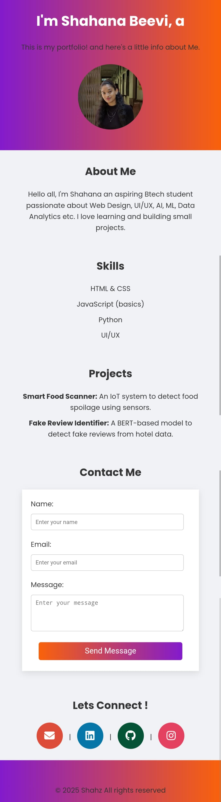

# Personal Portfolio Website

This is my personal portfolio website created as part of a 30-point challenge. It showcases who I am, my skills, and some projects I've worked on.

## Features

- About Me Section
- Skills
- Projects
- Contact Info
- Simple responsive design

## Technologies Used

- HTML
- CSS
- JavaScript(very less)

## 🌐 Live Link
https://shahz-ft.github.io/myprofile/

## 📸 Output Screenshots

